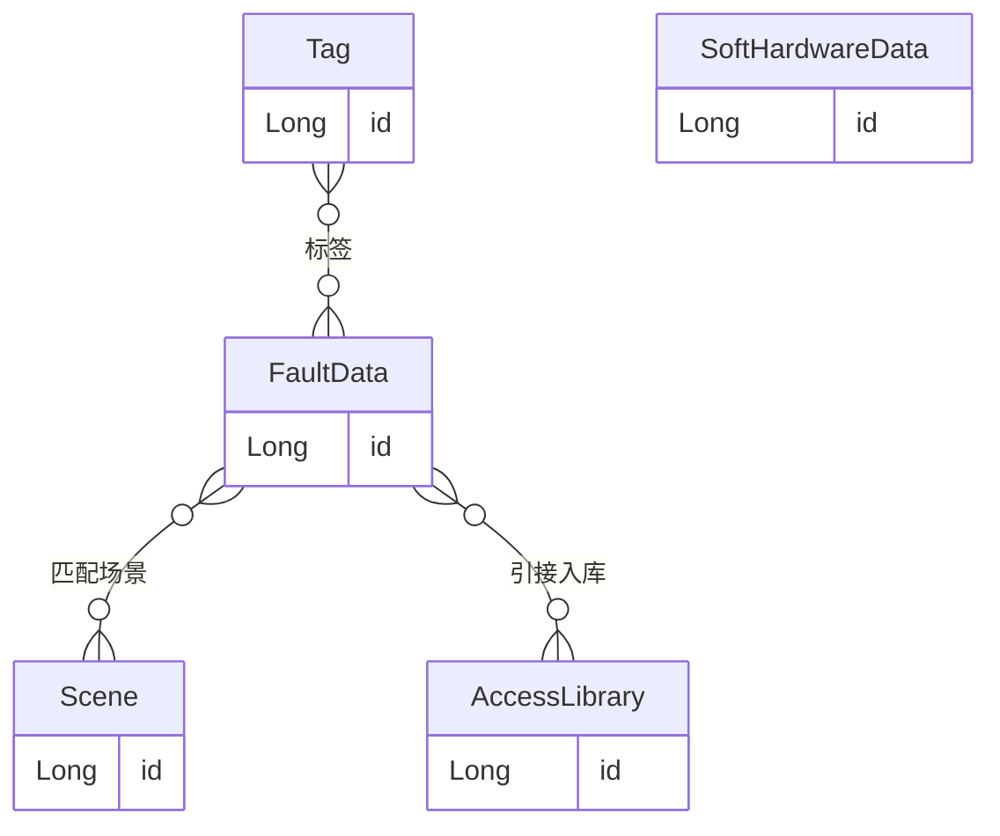

# 数据管理模块 - 精简版需求

> 依据 `ui/` 目录下“数据管理”相关 UI 文件名整理，**不增加 UI 中未出现的功能**。

---

## 一、边界说明

- **依据**：`ui/` 目录下各 PNG 文件名（`1-1 数据概览` / `1-2 故障数据` / `1-3 软硬件数据`）。
- **不包含**：复制、启用、停用、回收站、权限控制、操作日志等未在文件名或截图中体现的能力。

---

## 二、UI 文件名与功能映射

| 模块 | 文件名 | 功能 |
|------|--------|------|
| 概览 | 1-1 数据概览.png | 概览展示 |
| 故障数据 | 1-2-1 故障数据.png | 列表 |
| | 1-2-2 故障数据-新建.png | 新建 |
| | 1-2-2 故障数据-查看.png | 详情/查看 |
| | 1-2-3 故障数据-匹配场景.png | 匹配场景 |
| | 1-2-4 故障数据-引接入库.png | 引接入库 |
| | 1-2-5 故障数据-发布.png | 发布 |
| | 1-2-5 故障数据-下架.png | 下架 |
| | 1-2-6 故障数据-删除.png | 删除 |
| 软硬件数据 | 1-3-1 软硬件数据.png | 列表 |
| | 1-3-2 软硬件数据-编辑.png | 编辑 |

---

## 三、主要实体与关系

**说明**：本模块围绕两类数据（`故障数据`、`软硬件数据`）展开；其中 `故障数据` 还包含“匹配场景”“引接入库”“发布/下架”等动作，对应到数据关联关系与状态字段。

### 关系说明

| 实体A | 实体B | 关系 | 说明 |
|-------|-------|------|------|
| 故障数据 FaultData | 场景 Scene | N:M | 为“故障数据”选择对应场景（匹配场景） |
| 故障数据 FaultData | 接入库 AccessLibrary | N:M | 将“故障数据”引接入库（引接入库） |
| 标签 Tag | 故障数据 FaultData | N:M | 在故障数据新建/详情中维护标签 |

---

## 四、字典类型列表

| 字典编码 | 字典名称 | 使用场景 / 对应实体 | 说明 |
|----------|----------|---------------------|------|
| system_code | 系统编号 | FaultData / SoftHardwareData | 页面筛选项中的“系统编号/系统类型” |
| publish_status | 发布状态 | FaultData / SoftHardwareData | 页面表格中的“发布状态/发布” |
| fault_feature_version | 故障特征库版本 | FaultData | 新建/编辑弹窗中的“故障特征库版本”选择 |
| tag_name | 标签 | FaultData | 新建/查看弹窗中的“标签”选择 |

---

## 五、各实体功能与字段

### 1. 故障数据 FaultData

**UI 功能**：列表、新建、查看、**匹配场景**、**引接入库**、**发布/下架**、删除

**除 CRUD 外的动作**：

- **匹配场景**：为选中故障数据选择/绑定场景
- **引接入库**：将选中故障数据引接入库
- **发布/下架**：更新发布状态（列表存在“发布状态”列，并提供发布/下架入口）

**关键字段**：

| 字段 | 类型 | 说明 |
|------|------|------|
| id | 系统生成 | 主键 |
| name | 文本输入 | 名称（新建/查看/弹窗中展示） |
| systemCode | 枚举（字典 system_code） | 系统编号（列表筛选列中体现） |
| faultFeatureVersion | 枚举（字典 fault_feature_version） | 故障特征库版本 |
| tag | 枚举（字典 tag_name） | 标签（新建/查看弹窗中体现） |
| description | 文本输入 | 描述/备注（弹窗中存在描述项） |
| publishStatus | 枚举（字典 publish_status） | 发布状态（列表列名体现） |
| entryStatus | 枚举 | 录入状态/相关状态（列表中存在状态类列） |

---

### 2. 软硬件数据 SoftHardwareData

**UI 功能**：列表、编辑

**除 CRUD 外的动作**：

-（仅根据截图可见）编辑时更新数据字段；列表中未体现“发布/下架/删除”等额外动作入口

**关键字段**：

| 字段 | 类型 | 说明 |
|------|------|------|
| id | 系统生成 | 主键 |
| name | 文本输入 | 名称 |
| attributeCode | 文本/枚举 | 属性编号（列表表头体现为“属性编号”） |
| qualityControlCode | 文本/枚举 | 质控编号（列表表头体现为“质控编号”） |
| description | 文本输入 | 描述（编辑弹窗中体现） |
| systemCode | 枚举（字典 system_code） | 系统编号（编辑弹窗中体现“系统编号”） |
| publishStatus | 枚举（字典 publish_status） | 页面表格中的“发布/发布状态”列（若为展示字段则用于展示） |

---

### 3. 场景 Scene

**UI 入口**：匹配场景（从“匹配场景”弹窗选择）

**关键字段**：

| 字段 | 类型 | 说明 |
|------|------|------|
| id | 系统生成 | 主键 |
| sceneName | 文本/枚举 | 下拉选择项对应的名称（弹窗中体现） |

---

### 4. 标签 Tag

**UI 入口**：在故障数据新建/查看弹窗中选择标签

**关键字段**：

| 字段 | 类型 | 说明 |
|------|------|------|
| id | 系统生成 | 主键 |
| tagName | 文本/枚举 | 标签名称（弹窗下拉选项） |

---

### 5. 接入库 AccessLibrary

**UI 入口**：引接入库（从“引接入库”弹窗选择）

**关键字段**：

| 字段 | 类型 | 说明 |
|------|------|------|
| id | 系统生成 | 主键 |
| libraryName | 文本/枚举 | 下拉选择项对应名称（弹窗中体现） |

---

## 六、概览与统计（派生属性）

**1-1 数据概览** 可能展示：

- 顶部统计卡片（例如“平台数据总览/系统概览/用户数据概览”等分组统计项）
- 图表统计内容（截图中可见柱状图、占比/甜甜圈图等，用于展示“标注数据总数”“ZB 数据统计”等）
- 图表数据与列表口径一致（例如：故障数据、软硬件数据在列表的统计汇总可用于概览）

---

## 七、动作与属性影响汇总

| 实体 | 除 CRUD 外的动作 | 影响的属性/关系 |
|------|------------------|-----------------|
| FaultData | 匹配场景 | FaultData-Scene 关联关系 |
| FaultData | 引接入库 | FaultData-AccessLibrary 关联关系 |
| FaultData | 发布 | publishStatus（发布状态） |
| FaultData | 下架 | publishStatus（发布状态/下架状态） |
| FaultData | 删除 | 删除记录（及其关联关系如匹配/引接，按实现取舍） |
| SoftHardwareData | 编辑 | 更新字段（名称、系统编号、属性编号/质控编号、描述等） |

