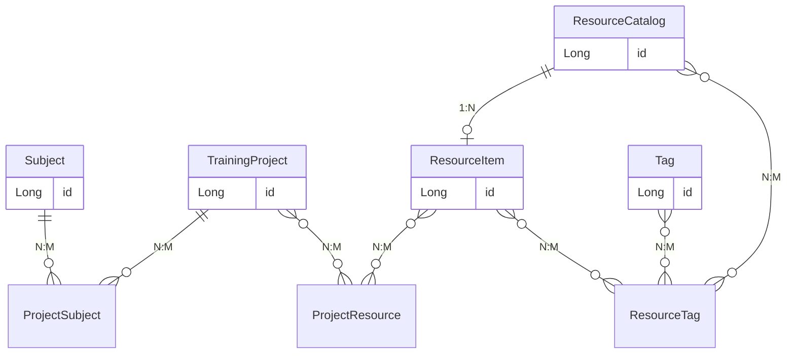

# 培训管理模块 - 精简版需求

> 依据 `ui/1-1培训管理` 目录下 UI 文件名整理，**不增加 UI 中未出现的功能**。

---

## 一、边界说明

- **依据**：`ui/1-1培训管理` 目录下各 PNG 文件名。
- **不包含**：复制、启用、停用、回收站、权限控制、操作日志等未在文件名中体现的能力。

---

## 二、UI 文件名与功能映射

| 模块 | 文件名 | 功能 |
|------|--------|------|
| 概览 | 1-1 培训管理-概览.png | 概览展示 |
| 教培科目管理 | 2-1-1 教培科目管理.png | 列表 |
| | 2-1-2 教培科目管理-详情.png | 详情 |
| | 2-1-3 教培科目管理-配置.png | 配置 |
| | 2-1-4 教培科目管理-新建.png | 新建 |
| | 2-1-5 教培科目管理-编辑.png | 编辑 |
| 项目管理 | 3-1-1 项目管理.png | 列表 |
| | 3-1-2 项目管理-绑定教培资源.png | 绑定教培资源 |
| | 3-1-3/4 教培科目管理-编辑/新建 2.png | 项目新建/编辑（含科目配置） |
| 资源编目 | 4-1-1 资源编目.png | 列表 |
| | 4-1-2 资源编目-详情.png | 详情 |
| | 4-1-3 资源编目-新建.png | 新建 |
| | 4-1-4 资源编目-编辑.png | 编辑 |
| | 4-1-5 资源编目-删除弹窗.png | 删除 |
| | 4-1-6 资源编目-发布.png | 发布 |
| 标签管理 | 4-2-1 标签管理.png | 列表 |
| | 4-2-2 标签管理-按需打标.png | 按需打标 |
| | 4-2-3 标签管理-新建.png | 新建 |
| | 4-2-4 标签管理-编辑.png | 编辑 |
| | 4-2-5 标签管理-详情.png | 详情 |
| | 4-2-6 标签管理-删除弹窗.png | 删除 |
| 教培资源管理 | 4-3-1 教培资源管理.png | 列表 |
| | 4-3-2 教培资源管理-新建.png | 新建 |
| | 4-3-3 教培资源管理-导入.png | 导入 |
| | 4-3-4 教培资源管理-详情.png | 详情 |
| | 4-3-5 教培资源管理-编辑.png | 编辑 |
| | 4-3-6 教培资源管理-删除弹窗.png | 删除 |
| 教培资源统计 | 4-4-1 教培资源统计.png | 统计展示 |

---

## 三、主要实体与关系

**说明**：科目与资源编目**无直接关联**。科目通过项目间接与教培资源产生关系：项目包含科目、项目绑定教培资源。

### 关系说明

| 实体A | 实体B | 关系 | 说明 |
|-------|-------|------|------|
| 培训科目 Subject | 培训项目 TrainingProject | N:M | 一个项目含多科目，一科目可被多项目使用 |
| 资源编目 ResourceCatalog | 教培资源 ResourceItem | 1:N | 一个编目下可有多个资源文件 |
| 培训项目 TrainingProject | 教培资源 ResourceItem | N:M | 绑定教培资源 |
| 标签 Tag | 资源编目 ResourceCatalog | N:M | 按需打标 |
| 标签 Tag | 教培资源 ResourceItem | N:M | 按需打标 |

---

## 四、字典类型列表

| 字典编码 | 字典名称 | 使用场景 / 对应实体 | 说明 |
|----------|----------|---------------------|------|
| system_code | 所属系统 | Subject（培训科目） | 科目归属的系统，来源 t_system_dict |
| project_type | 项目类型 | TrainingProject（培训项目） | 如集中培训、在线培训等 |
| resource_category | 资源类型 | ResourceCatalog（资源编目） | 如视频、文档、课件等 |
| publish_status | 发布状态 | ResourceCatalog（资源编目） | 草稿、已发布 |
| file_type | 文件类型 | ResourceItem（教培资源） | 如视频、PPT、PDF 等 |
| tag_type | 标签类别 | Tag（标签） | 如主题、难度、角色等 |

---

## 五、各实体功能与字段

### 1. 培训科目 Subject

**UI 功能**：列表、详情、新建、编辑、**配置**

**除 CRUD 外的动作**：
- **配置**：在配置界面进行科目相关配置，具体内容以 UI 为准（科目与资源编目无直接关联）。

**关键字段**：

| 字段 | 类型 | 说明 |
|------|------|------|
| id | 系统生成 | 主键 |
| subjectName | 文本输入 | 科目名称 |
| subjectDesc | 文本输入 | 科目描述 |
| systemCode | 枚举（字典 system_code） | 所属系统编码 |
| createTime / updateTime | 系统生成 | 创建/更新时间 |

---

### 2. 培训项目 TrainingProject

**UI 功能**：列表、新建、编辑、**绑定教培资源**

**除 CRUD 外的动作**：
- **绑定教培资源**：为项目选择教培资源进行绑定或解绑，影响项目与 ResourceItem 的 N:M 关系

**关键字段**：

| 字段 | 类型 | 说明 |
|------|------|------|
| id | 系统生成 | 主键 |
| projectName | 文本输入 | 项目名称 |
| projectCode | 文本输入 | 项目编码 |
| projectType | 枚举（字典 project_type） | 项目类型 |
| startDate / endDate | 日期选择 | 计划开始/结束时间 |
| description | 文本输入 | 项目简介 |
| boundResourceCount | 统计 | 已绑定资源数量 |
| createTime / updateTime | 系统生成 | 创建/更新时间 |

---

### 3. 资源编目 ResourceCatalog

**UI 功能**：列表、详情、新建、编辑、删除、**发布**

**除 CRUD 外的动作**：
- **发布**：将编目从草稿切换为已发布，影响 status

**关键字段**：

| 字段 | 类型 | 说明 |
|------|------|------|
| id | 系统生成 | 主键 |
| title | 文本输入 | 资源标题 |
| category | 枚举（字典 resource_category） | 资源类型 |
| description | 文本输入 | 资源简介 |
| status | 枚举（字典 publish_status） | 草稿/已发布 |
| learnedUserCount | 统计 | 已学习人数（由概览/统计 UI 补充） |
| createTime / updateTime | 系统生成 | 创建/更新时间 |

---

### 4. 教培资源 ResourceItem

**UI 功能**：列表、详情、新建、编辑、删除、**导入**

**除 CRUD 外的动作**：
- **导入**：批量导入资源文件

**关键字段**：

| 字段 | 类型 | 说明 |
|------|------|------|
| id | 系统生成 | 主键 |
| catalogId | 枚举（编目选择） | 所属资源编目 |
| fileName | 文本（上传后生成） | 文件名 |
| fileType | 枚举（字典 file_type） | 文件类型 |
| fileSize | 数值（展示） | 文件大小 |
| boundProjectCount | 统计 | 被项目绑定数量 |
| learnedUserCount | 统计 | 已学习人数（由概览/统计 UI 补充） |
| createTime / updateTime | 系统生成 | 创建/更新时间 |

---

### 5. 标签 Tag

**UI 功能**：列表、详情、新建、编辑、删除、**按需打标**

**除 CRUD 外的动作**：
- **按需打标**：为选中的资源（编目或实体）批量添加/移除标签

**关键字段**：

| 字段 | 类型 | 说明 |
|------|------|------|
| id | 系统生成 | 主键 |
| tagName | 文本输入 | 标签名称 |
| tagType | 枚举（字典 tag_type） | 标签类别 |
| description | 文本输入 | 标签说明 |
| usageCount | 统计 | 被资源使用次数 |
| createTime / updateTime | 系统生成 | 创建/更新时间 |

---

## 六、概览与统计（派生属性）

**1-1 培训管理-概览** 可能展示：
- 项目总数、进行中项目数
- 科目总数
- 资源总数
- 已学习人数汇总（来自 learnedUserCount）

**4-4-1 教培资源统计** 可能展示：
- 按资源类型（fileType）的数量分布
- 按标签的资源数量
- 按已学习人数的资源排行

---

## 七、动作与属性影响汇总

| 实体 | 除 CRUD 外的动作 | 影响的属性/关系 |
|------|------------------|-----------------|
| Subject | 配置 | 科目相关配置（以 UI 为准，科目与资源编目无直接关联） |
| TrainingProject | 绑定教培资源 | TrainingProject-ResourceItem N:M、boundResourceCount |
| ResourceCatalog | 发布 | status |
| ResourceItem | 导入 | 批量新增 ResourceItem |
| Tag | 按需打标 | Tag-Resource N:M、usageCount |
